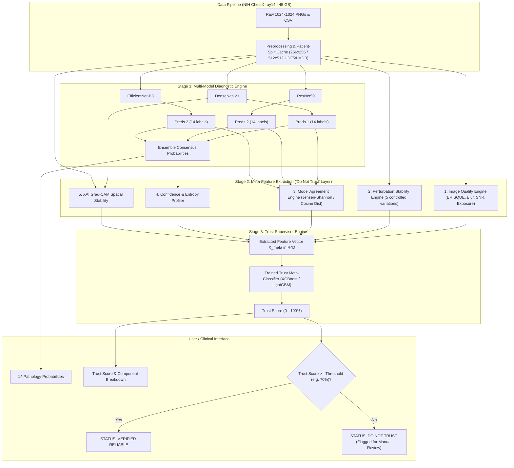

# Product Requirements Document (PRD)

## Project Name: **MedTrust-XRay: Clinically-Calibrated Reliability & "DO NOT TRUST" Layer for Multi-Label Chest Radiography**
**Target Dataset**: NIH ChestX-ray14 (112,120 Frontal-view X-rays, 30,805 Unique Patients, 14 Thoracic Pathologies)  
**Document Status**: Draft / V1.0  
**Authors**: AI Engineering & Research Team  

---

## 1. Executive Summary & Problem Statement

### 1.1 The Clinical Problem
Deep learning models deployed in clinical imaging (such as DenseNet121 trained on NIH ChestX-ray14) routinely achieve high AUCs (>0.80). However, modern neural networks suffer from **severe overconfidence**:
- A model can predict a 97% probability for Pneumonia on an out-of-focus, underexposed, or noisy radiograph, or when an adversarial artifact / medical device confuses the feature extractors.
- In multi-label pathology detection, clinical deployment fails not because the model never predicts accurately, but because clinicians cannot identify **when the model is hallucinating or brittle**.
- Standard raw sigmoid probabilities are uncalibrated and blind to image corruption, out-of-distribution artifacts, and model epistemic uncertainty.

### 1.2 The Proposed Solution
**MedTrust-XRay** introduces a two-tier paradigm:
1. **Stage 1 (Diagnostic Inference)**: A multi-backbone multi-label ensemble (DenseNet121, ResNet50, EfficientNet-B3/B4) outputting calibrated probabilities for 14 thoracic disease labels.
2. **Stage 2 (The "DO NOT TRUST" Meta-Reliability Layer)**: An independent supervisor that computes a multi-modal feature vector for each radiograph across:
   - **Signal/Image Quality Metrics** (Blur, Contrast, Noise, Exposure)
   - **Classifier Confidence & Entropy** (Margin, Shannon Entropy, Top-k dispersion)
   - **Perturbation Stability Score** (Prediction invariance under physiological transformations)
   - **Multi-Model Agreement** (Consensus across divergent inductive biases)
   - **Saliency / XAI Attribution Stability** (Grad-CAM spatial consistency)
3. **Trust Meta-Classifier**: An XGBoost / LightGBM / MLP meta-model that predicts $P(\text{Reliable}=1 \mid \mathbf{x})$, producing an auditable **Trust Score (0–100%)** and a binary **"TRUST" vs "DO NOT TRUST"** flag before the prediction reaches the radiologist.

---

## 2. System Architecture

---

## 3. Detailed Component Specifications

### 3.1 Stage 1: Base Multi-Label Classifiers
- **Dataset Targets (14 Pathologies)**:
  1. Atelectasis, 2. Cardiomegaly, 3. Effusion, 4. Infiltration, 5. Mass, 6. Nodule, 7. Pneumonia, 8. Pneumothorax, 9. Consolidation, 10. Edema, 11. Emphysema, 12. Fibrosis, 13. Pleural Thickening, 14. Hernia.
- **Backbone Architectures**:
  - **DenseNet121**: Feature reuse via dense connections; optimal for fine radiologic textures.
  - **ResNet50**: Residual skip connections providing diverse feature gradient flow.
  - **EfficientNet-B3**: Scaled depth/width/resolution compound coefficient.
- **Loss Function**:
  - Standard Binary Cross-Entropy suffers under 90%+ negative imbalance per class.
  - Preferred: **Asymmetric Loss (ASL)** or **Weighted BCEWithLogitsLoss** with positive sample weights calculated from dataset frequencies:
    $$\text{pos\_weight}_c = \frac{N - N_c}{N_c}$$
- **Post-Hoc Calibration**:
  - Temperature scaling or Platt scaling applied per pathology head on the validation split.

---

### 3.2 Stage 2: The "DO NOT TRUST" Meta-Feature Engines

| Engine | Metrics / Algorithms | Output Dimensions |
| :--- | :--- | :--- |
| **1. Image Quality (IQ)** | - Laplacian Variance (Blur / Defocus) - Michelson & RMS Contrast - Exposure Fraction (Clipped black/white pixels) - Signal-to-Noise Ratio (SNR) proxy | 4 scalar values |
| **2. Confidence & Entropy** | - Max Probability across 14 labels: $\max_i(p_i)$ - Multi-label Margin: Difference between positive and negative decision boundaries - Binary Entropy Mean: $-\frac{1}{14}\sum_{i=1}^{14}[p_i \log p_i + (1-p_i)\log(1-p_i)]$ | 3 scalar values |
| **3. Perturbation Stability** | Generated 5 stochastic/deterministic variations: 1. Brightness shift ($\pm 10\%$), 2. Contrast adjustment ($\gamma \in [0.85, 1.15]$), 3. Gaussian noise ($\sigma = 0.02$), 4. Translation ($\pm 4\%$), 5. Subtle zoom ($1.04\times$). - **Metric**: Cosine similarity & Mean Absolute Variation across predictions $\frac{1}{K}\sum \|P_{\text{orig}} - P_k\|_1$. | 3 scalar values (Mean Diff, Max Diff, Cosine Invariance) |
| **4. Multi-Model Agreement** | Compare predictions $P_{\text{DenseNet}}$, $P_{\text{ResNet}}$, $P_{\text{EfficientNet}}$: - Pairwise Jensen-Shannon Divergence or Cosine Dissimilarity - Variance of predicted positive label counts | 3 scalar values |
| **5. Saliency / XAI Stability** | Grad-CAM generated on $I_{\text{orig}}$ vs $I_{\text{perturbed}}$: - Bounding box / mask Intersection over Union (IoU) of top 20% activation energy - Spearman rank correlation of heatmap pixels | 2 scalar values |

**Total Feature Vector $\mathbf{X}_{\text{meta}}$**: Vector of ~15–18 engineered continuous features per test image.

---

### 3.3 Stage 3: The Trust Model (Meta-Classifier)

#### Target Definition ($y_{\text{trust}}$)
To train the trust model supervisedly on a held-out validation set:
For an image $i$, let $Y_i \in \{0, 1\}^{14}$ be true binary labels and $\hat{Y}_i = \mathbb{I}(P_i \ge \tau_c)$ be predicted labels (with optimal threshold $\tau_c$ per class):
- **Clinical Utility Rule**:
  - If any active disease is missed (False Negative on critical diseases: Pneumothorax, Pneumonia, Infiltration) $\implies y_{\text{trust}} = 0$.
  - If a disease is falsely triggered (False Positive) $\implies y_{\text{trust}} = 0$.
  - Exact or high-overlap match ($F_1 \ge 0.75$) without critical hallucinations $\implies y_{\text{trust}} = 1$.

#### Supervised Meta-Models
1. **XGBoost / LightGBM Classifier** (Primary baseline: fast, handles non-linear interactions, provides direct SHAP feature importance).
2. **Multi-Layer Perceptron (MLP)** with dropout and calibrated sigmoid output.
3. **Output**: $P(\text{Reliable} = 1) \in [0, 1] \implies \text{Trust Score} = 100 \times P(\text{Reliable} = 1)$.

---

## 4. Acceptance Criteria & Evaluation Metrics

1. **Diagnostic Performance (Stage 1)**:
   - Mean ROC-AUC across 14 pathologies $\ge 0.81$ (comparable to CheXNet baseline).
2. **Selective Classification / Risk-Coverage Curve (Stage 2 & 3)**:
   - **Risk at Coverage**: When discarding the lowest 20% Trust Score cases (routing them to human radiologists), the error rate on the retained 80% must decrease by at least **35%**.
   - **AU-RC (Area Under Risk-Coverage Curve)**: Significantly lower than standard softmax confidence baseline.
   - **Detection of Corrupted Images**: When synthetic noise/defocus/exposure corruption is introduced, the system must trigger `DO NOT TRUST` on $\ge 90\%$ of corrupted instances.
3. **Inference Latency**:
   - Total pipeline execution time (Image Quality + 5 Perturbations + Ensemble + Trust Model) $\le 650\text{ ms}$ on an NVIDIA RTX 3080/4090 or T4 GPU.

---

## 5. Implementation Milestones

- **Milestone 1**: 45 GB Dataset Preprocessing, Patient-Wise Partitioning, and Pre-cached Storage Setup.
- **Milestone 2**: Stage 1 Training of DenseNet121, ResNet50, and EfficientNet with Mixed Precision & Asymmetric Loss.
- **Milestone 3**: Feature Extraction Pipeline for Image Quality, Stability, and Consensus.
- **Milestone 4**: Trust Dataset Generation ($X_{\text{meta}}, y_{\text{trust}}$) and XGBoost Meta-Model Training.
- **Milestone 5**: Interactive Demonstration UI / CLI generating the final calibrated report card.
